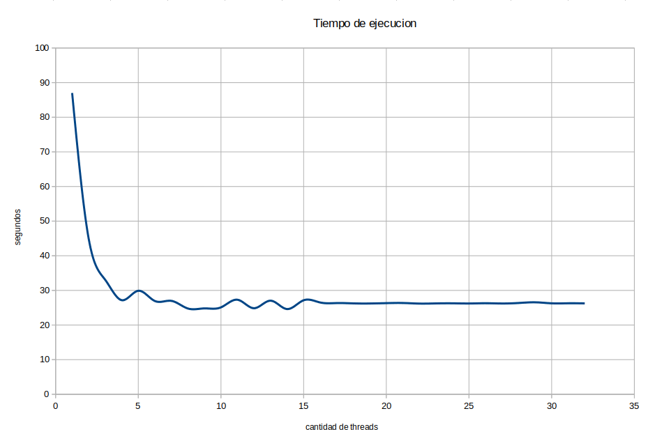

Laboratorio IV Sistemas Operativos 2 
### Ingeniería en Computación - FCEFyN - UNC
# Memoria compartida

## Desarrollo
Para resolver la consigna primero era necesario obtener la matriz a partir de imagen. Para esto se realizo un script en python que utilizando la libreria `cv2` extrae la matriz de grayscales con valores entre 0 y 255 la cual es exportada a un file que luego sera leido por el programa en C.

El programa en C realiza el calculo de distancias recorriendo la el template por toda la imagen y genera una matriz de distancias de tamaño (w1-w2)x(h1-x2) siendo:
- w1: ancho de la imagen en pixeles
- w2: ancho del template en pixeles
- h1: altura de la imagen en pixeles
- h2: altura del template en pixeles

Obtenida la matriz de distancias se buscan las coordenadas del menor valor en dicha matriz. Estas coordenadas son donde se "apoya" la esquina superior izquierda del template.
Utilizando estas coordenadas, otro script en python procede a dibujar un cuadrado verde indicando donde se encuentra el template en la imagen.
## Paralelismo
El algoritmo de calculo de matriz de ditancias fue paralelizado con la libreria `openMP` haciendo uso de `#pragma omp parallel for private(i,j,y,x) num_threads(threads)` siendo i, j, y, x las variables que se usan para iterar los for.
Un script de bash permite elegir cuantos `threads` se van a utilizar para realizar la tarea, y se puede observar como aumenta el rendimiento a medida que se aumentan los hilos, pero en mi caso al tener 4 nucleos fisicos la tarea no obtiene mejoras notables en su rendimento con mas de 4 hilos.

